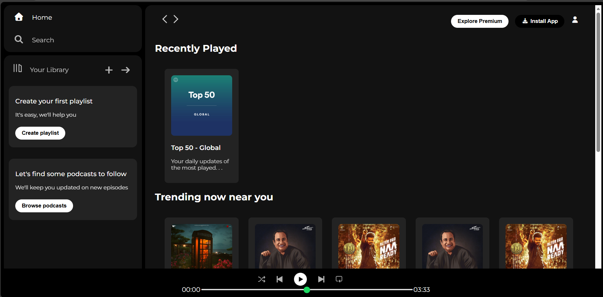

# Spotify Web Player Clone

This project is a static web clone of the Spotify Web Player interface, built using HTML and CSS. It focuses on replicating the visual design and layout of the popular music streaming service, including the sidebar, main content area, and the bottom playback controls.

## Features

- **Responsive Layout**: Designed with a flexbox-based layout featuring a fixed sidebar and a scrollable main content area.
- **Sticky Navigation**: The top navigation bar in the main content area remains sticky upon scrolling.
- **Interactive Elements**: Includes hover effects on navigation links, library icons, and cards to enhance user experience.
- **Music Player Controls**: A static visual representation of the playback bar with playback controls (shuffle, prev, play, next, repeat) and a progress bar.
- **Card-Based UI**: Displays playlists and charts in a grid layout using card components, similar to Spotify's interface.

## Technologies Used

- **HTML5**: For structuring the web page content.
- **CSS3**: For styling, layout (Flexbox), and responsiveness.
- **Font Awesome**: Used for icons throughout the interface (navigation, playback controls, social icons).
- **Google Fonts**: Uses the "Montserrat" font family to match Spotify's typography.

## How to View

1.  Clone the repository or download the source files.
2.  Open the `index.html` file in any modern web browser.
3.  Explore the interface!

## Project Structure

- `index.html`: The main HTML structure of the page.
- `style.css`: Contains all the global styles, layout definitions, and component styles.
- `assets/`: Directory containing images and icons used in the project (e.g., logos, card images, player icons).

## Screenshots

